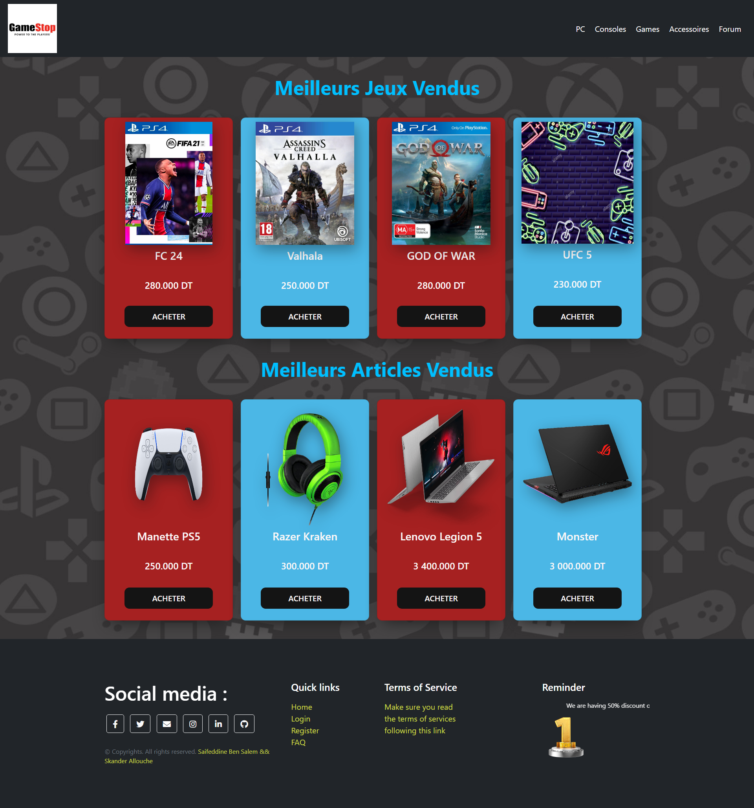
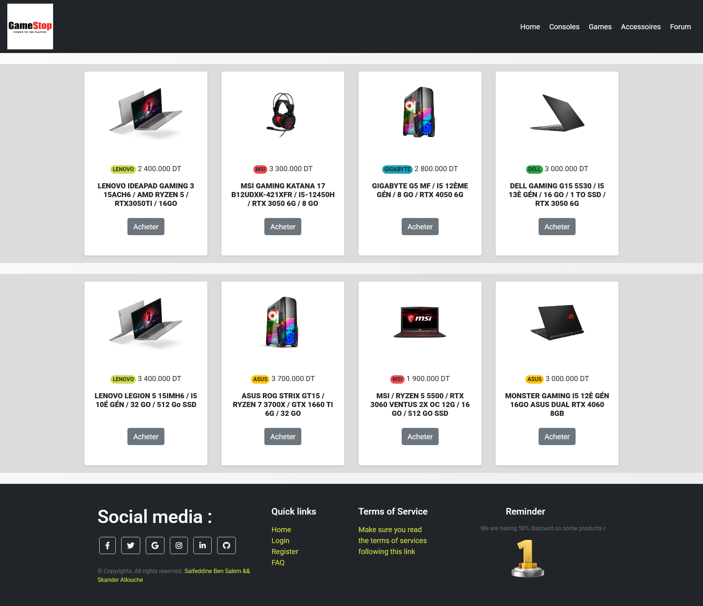
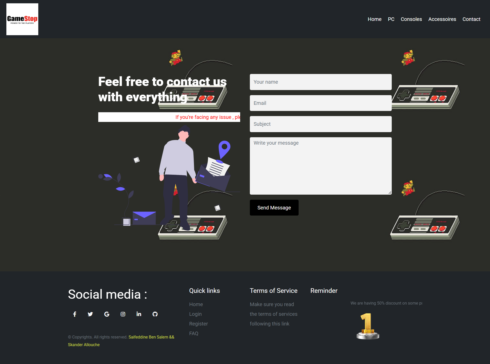

# Gaming Store

A small, static gaming and computer store front end built with HTML, CSS, and JavaScript. The site presents video games, computers, consoles, and accessories, and includes a contact form for questions and purchase enquiries.

## Photos




## Features

- Home page with featured games and accessories.
- Separate catalog pages for computers and consoles.
- Shared navigation and footer styling across the pages.
- Responsive layouts built with Bootstrap 4 and custom CSS.
- Contact form with browser-side validation, EmailJS delivery, and a `mailto:` fallback when the online service is unavailable.
- Local product images, icons, stylesheets, and JavaScript libraries.

The project is a front-end demonstration. It does not include a server, database, shopping cart, payment processing, or order management. Product purchase buttons take visitors to the contact form to make an enquiry.

## Pages

| File | Purpose |
| --- | --- |
| `accueil.html` | Home page with featured games and accessories. |
| `accueil2.html` | Computer catalog. |
| `console2.html` | Console catalog. |
| `help.html` | Contact form and project contact information. |
| `blank.html` | Starter page containing the shared navigation and footer markup. |

The page and asset paths use lowercase names. Keep this casing when linking files, especially when hosting on a case-sensitive server such as GitHub Pages.

## Project Structure

```text
.
|-- accueil.html               # Home page
|-- accueil.css                # Home page and featured product styles
|-- accueil2.html              # Computer catalog
|-- accueil2.css               # Computer catalog styles
|-- console2.html              # Console catalog
|-- console2.css               # Console catalog styles
|-- help.html                  # Contact form
|-- blank.html                 # Shared page template
|-- controles.js               # Legacy age prompt; not loaded by current pages
|-- README.md
|-- css/
|   |-- bootstrap.min.css      # Bootstrap 4 styles
|   |-- commun.css             # Shared navigation and footer styles
|   `-- help.css               # Contact page styles
|-- image/
|   |-- commun/                # Shared images, including footer promotion
|   `-- forums/                # Contact page illustration
`-- js/
    |-- bootstrap.min.js       # Bootstrap 4 JavaScript
    |-- contact.js             # Contact form handling and fallback
    |-- jquery-3.3.1.min.js     # jQuery dependency
    `-- jquery.validate.min.js # jQuery Validation plugin
```

Product images are stored directly inside `image/`; shared and contact-page illustrations are in the subfolders shown above.

## Requirements

- A modern web browser.
- A local static web server for reliable testing. No build step or package installation is required.
- Internet access for Google Fonts, Font Awesome, and EmailJS. The main stylesheets, Bootstrap files, and images are stored in the project.
- An EmailJS account if the contact form should deliver messages online.

## Run Locally

### Visual Studio Code

Open the project folder in VS Code, start the **Live Server** extension on `accueil.html`, and use the local URL it provides. Using a local server is recommended over opening the file directly, especially when testing the contact form.

### Python

From the project root, start Python's built-in static server:

```powershell
python -m http.server 8000
```

Then open [http://localhost:8000/accueil.html](http://localhost:8000/accueil.html) in a browser. Stop the server with `Ctrl+C` in the terminal.

## Publish with GitHub Pages

1. Push the project to a GitHub repository.
2. In the repository, open **Settings > Pages**.
3. Under **Build and deployment**, select **Deploy from a branch**, then select the branch containing the project and the repository root (`/`) as the folder.
4. Save and wait for GitHub Pages to publish the site.
5. Open the published site at `https://<owner>.github.io/<repository>/accueil.html` and test its navigation and contact form.

There is no `index.html` in this project, so the repository's Pages root is not the home page. Open `accueil.html` explicitly, or add an `index.html` that redirects to it if a root landing URL is needed. Update the EmailJS allowed-domain settings to include the published domain before testing online email delivery.

## Contact Form Setup

The form handler is `js/contact.js`. It submits the form to EmailJS using the service, template, and public key configured in that file. To use your own EmailJS account:

1. Create an EmailJS service and email template.
2. Configure the template to accept `from_name`, `from_email`, `subject`, and `message` fields.
3. Replace the service ID, template ID, and public key in `js/contact.js` with the values from your EmailJS account.
4. Restrict the EmailJS public key to the domains where the site is hosted, following EmailJS security guidance.
5. Test a successful submission and a failed/offline submission from a locally served page.

The public key is intended for browser use, but it should be restricted to trusted domains. Do not put a private secret or server credential in client-side JavaScript. If EmailJS is blocked or unavailable, the form displays a link that opens the visitor's default email application with the message details filled in; that fallback still requires the visitor to send the email.

## Technologies

- HTML5
- CSS3
- JavaScript (ES6)
- Bootstrap 4
- jQuery 3.3.1 and jQuery Validation
- EmailJS Browser SDK 3
- Google Fonts and Font Awesome (loaded from external CDNs)

## Testing and Troubleshooting

There is no build system or automated test suite included. For a manual check:

1. Open each page listed above and navigate between the catalogs and contact form.
2. Check that product images and page-specific styling load. Keep file and directory names, including capitalization, exactly as written in the HTML.
3. Submit the contact form with required fields blank to verify browser validation.
4. With valid EmailJS configuration, submit a test message. If the service is unavailable, confirm that the email fallback appears.
5. If a page appears unstyled or an image is missing, check the browser developer console and network panel for a 404 response and verify the relative path from that HTML or CSS file.

## Customization

- Add or update products in `accueil.html`, `accueil2.html`, and `console2.html`.
- Store product images in `image/` and use relative paths such as `image/ps41.png` from a root-level HTML page.
- Update shared navigation and footer styles in `css/commun.css`.
- Keep links pointed at pages or section IDs that exist; the home page provides `#games` and `#accessories` anchors, and the contact page provides `#contactForm`.
